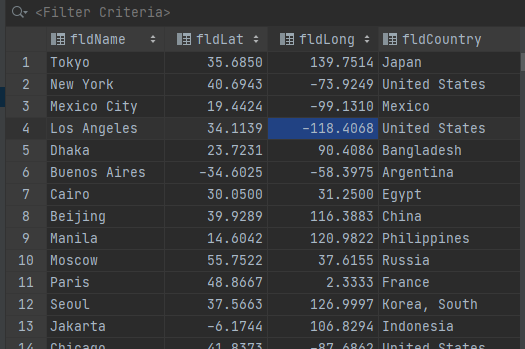
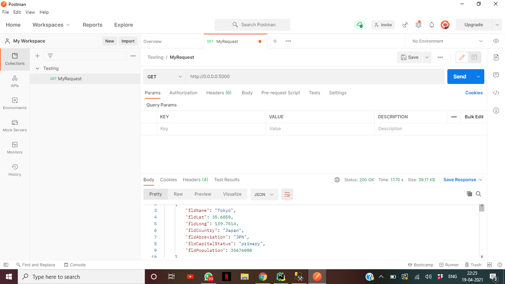
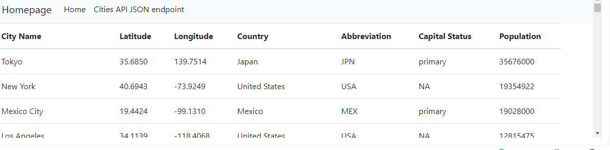
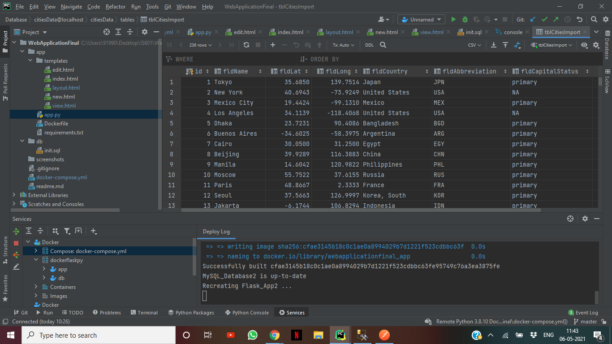
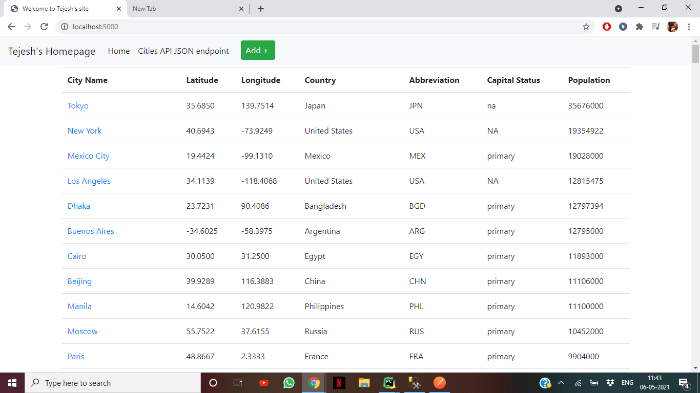
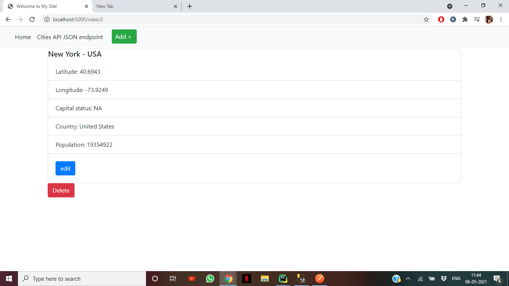
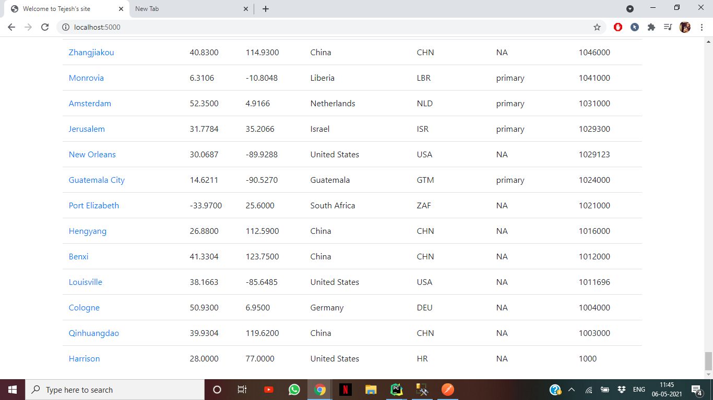
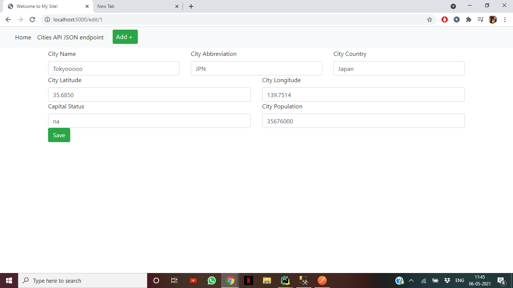
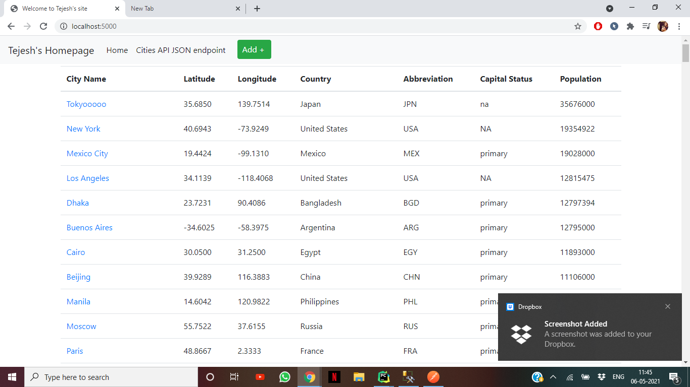

# Project Description

This project is a homework assignment to teach how to get Pycharm setup with Docker, Flask, MySQL, and Postman

# SQL Data Screenshot

 
# Postman Screenshot

# Part2 Screenshot 

# a)The project showing that you can view your data tables in pycharm.

# b)The project running correctly in the browser displaying your homepage with your data

# c)The project running correctly in the browser displaying your data record as a view of one record

# d)The project running correctly in the browser displaying a new record added to your home page

# e)The project running correctly in the browser displaying an updated record added to your home 
page

# f)The project running correctly in the browser displaying a deleted record added to your home 
page

